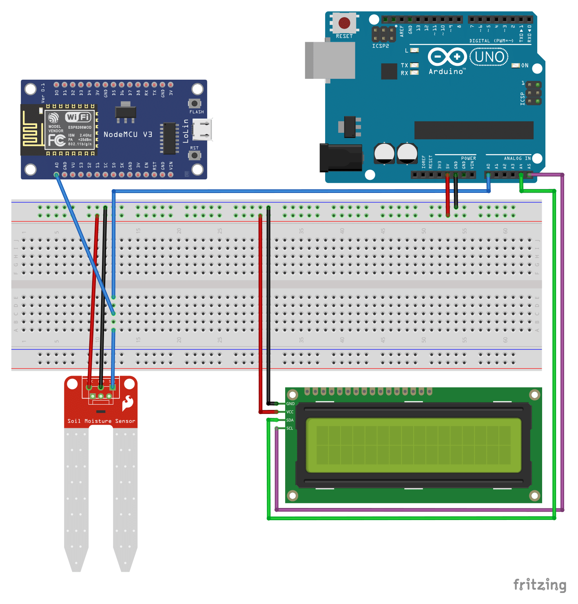

[View final setup instructions](https://github.com/farhan2077/happy-plant#setup)

<h1>Microcontroller codes and schematics of <a href="https://github.com/farhan2077/happy-plant">Happy Plant</a> </h1>

## Setup

Microcontroller part has two setup processes. Sketches and schematics for `Arduino` can be found in [arduino-section](https://github.com/farhan2077/happy-plant/blob/main/microcontroller/arduino-section) folder and for `NodeMCU ESP8266`, they can be found in [wifi-module-section](https://github.com/farhan2077/happy-plant/blob/main/microcontroller/wifi-module-section) folder.

Final circuit diagram should look like below:

