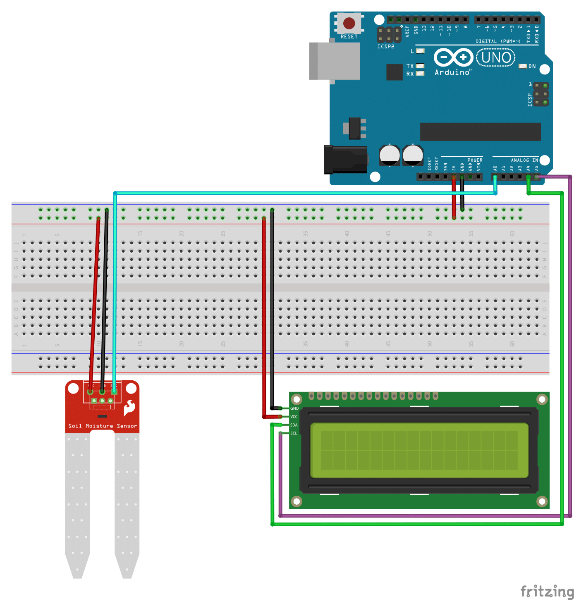

[View final setup instructions](https://github.com/farhan2077/happy-plant#setup)

# Sketches and schematics for `arduino-section`

## Setup

1. Go to [https://github.com/fdebrabander/Arduino-LiquidCrystal-I2C-library](https://github.com/fdebrabander/Arduino-LiquidCrystal-I2C-library) and download the github repo.

2. Extract the downloaded zip file. A folder called `Arduino-LiquidCrystal-I2C-library-master` will appear.

3. Copy that folder with all the files inside to the following location.

```
C:\Program Files (x86)\Arduino\libraries
```

_NOTE: This locaton is only applicable for `windows` file system. For `mac` or `linux`, it will be different._

4. Connect `Arduino` with the necessary hardwares like the following schematics
   

5. Again from `Tools` menubar, select `Arduino Uno` from `Board` and the right `Port`.

6. Now you are all set up and good to go!
