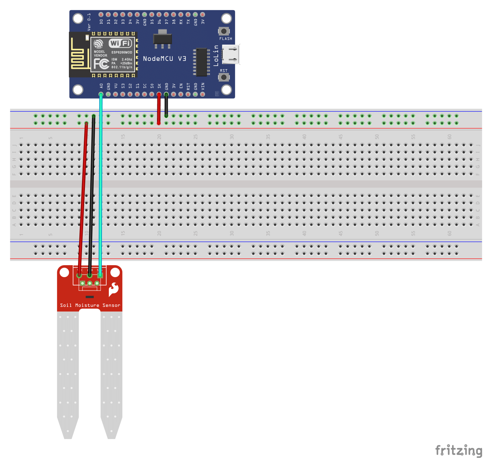

[View final setup instructions](https://github.com/farhan2077/happy-plant#setup)

# Sketches and schematics for `esp8266-section`

## Setup

1. Open Arduino IDE and from the menubar go to `Tools > Manage Libraries`. Search for `ArduinoJson` and install the library called `ArduinoJson` by `Benoît Blanchon`. (`v6` is preferrable)

2. Again from the menu bar, go to `File > Preferences`. Now in the preferences window, input `https://arduino.esp8266.com/stable/package_esp8266com_index.json` in the `Additional Boards Manager URLs` placeholder.

3. Connect `ESP8266` with the necessary hardwares like the following schematics
   

4. Again from `Tools` menubar, select `NodeMCU 1.0 (ESP-12E Module)` from `Board` and the right `Port`.

5. Now you are all set up and good to go!
